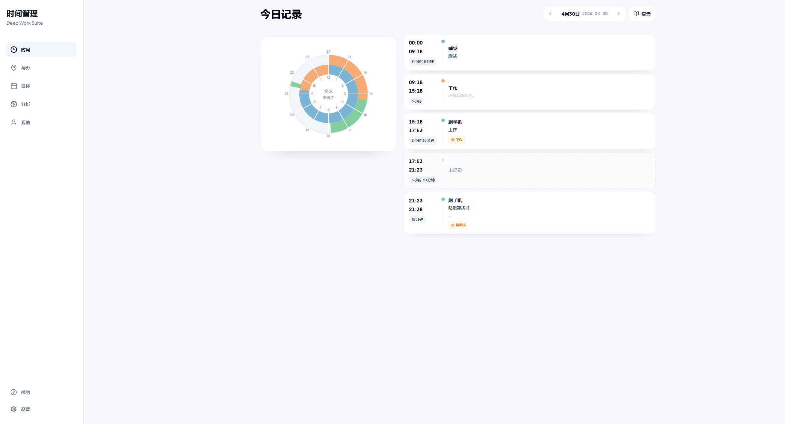
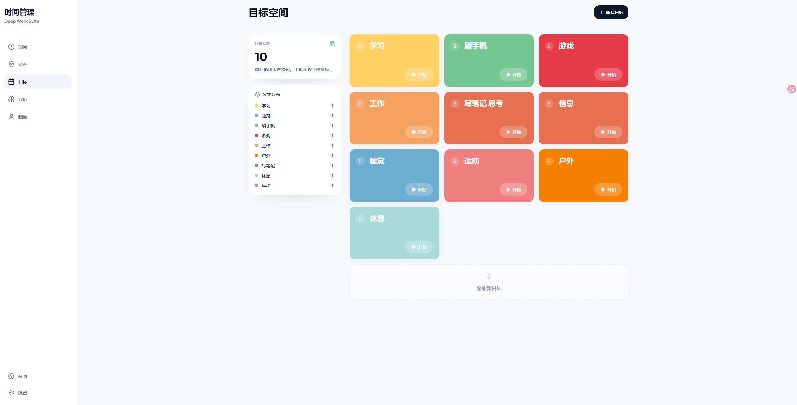
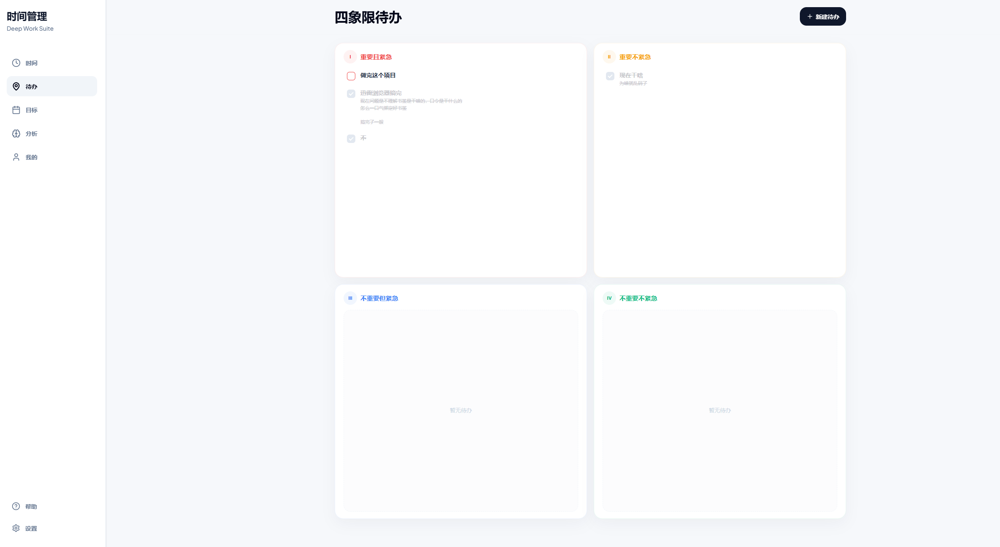
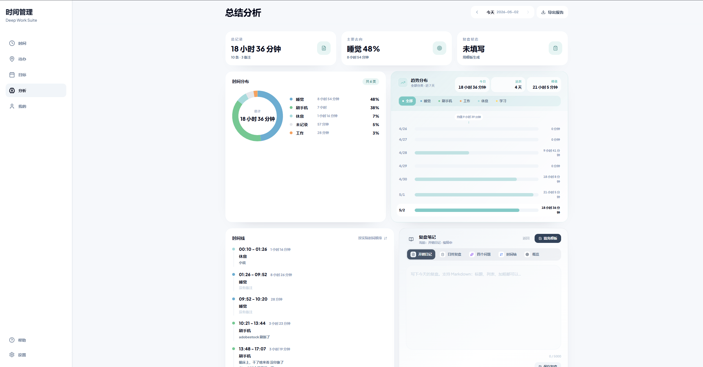

  <h1>爱时间 · Deep Work Suite</h1>
  
一套把时间记录、目标管理、复盘和分析串成闭环的时间管理工具。

## 项目亮点

- 目标、计时、时间线、分析、复盘统一联动
- 分类和目标绑定，记录更顺手
- 支持编辑、合并、补记、取消计时
- 本地 SQLite 数据库，前后端分离
- 适合个人深度工作和内容展示

## 产品展示

<table>
  <tr>
    <td></td>
    <td></td>
  </tr>
  <tr>
    <td></td>
    <td></td>
  </tr>
</table>

## 技术栈

- `React` + `Vite`
- `TypeScript`
- `Tailwind CSS`
- `Express`
- `SQLite`

## 目录结构

- `src/` 前端界面和业务逻辑
- `server/` API、鉴权和数据库逻辑
- `docs/media/readme/` README 演示图
- `data/` 本地数据库文件
- `uploads/` 上传图片

## 本地运行

1. 安装依赖：`npm install`
2. 复制 `.env.example` 为 `.env`
3. 配置 `JWT_SECRET` 和需要的 OSS / Proxy 环境变量
4. 启动开发环境：`npm run dev:all`
5. 打开 `http://localhost:5173`

## 说明

- `data/`、`uploads/`、`.env` 都已加入忽略列表，不会提交到仓库
- README 中使用的截图全部来自本项目本身
